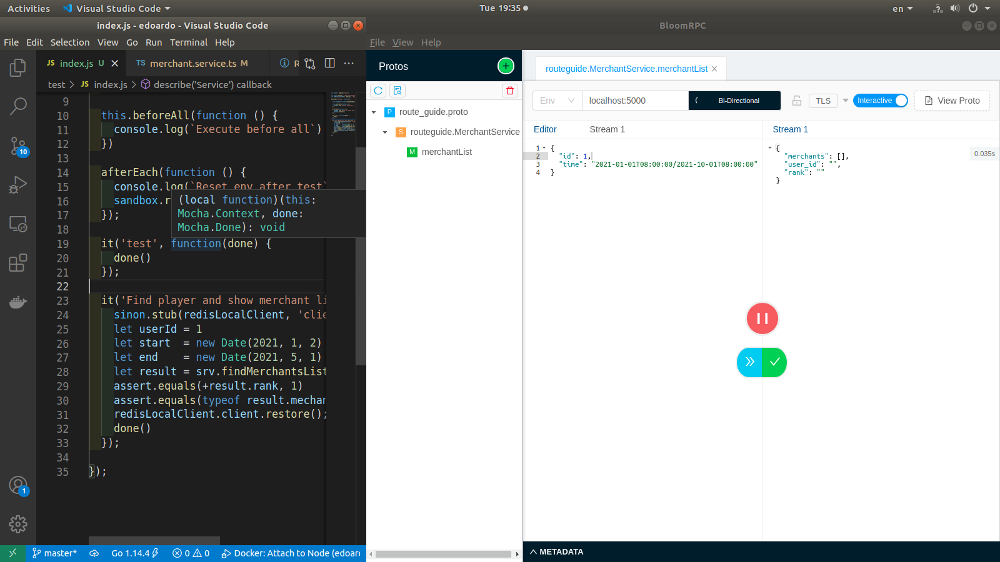

# Db Scalability Challenge


| Title | Vendor | Descriptions |
|---:|:---|:---:|
|Platform| nodejs > v10 ||
|Core| gRPC ||
|Database| postgres | replicated (1 master/3 node) |
|Cache| redis | single instance |
|Test engine| mocha | coverage < %60 |
|Dockerrized| true |  |
|Orchestrator| docker-compose (v3.7)|  |

## Development

```bash
npm run start
```

## Docker envirnoment

For start server you can use
```bash
docker-compose -f db_wrapper up
```
and finally for shutdown use
```bash
docker-compose -f db_wrapper down
```

## Screen

